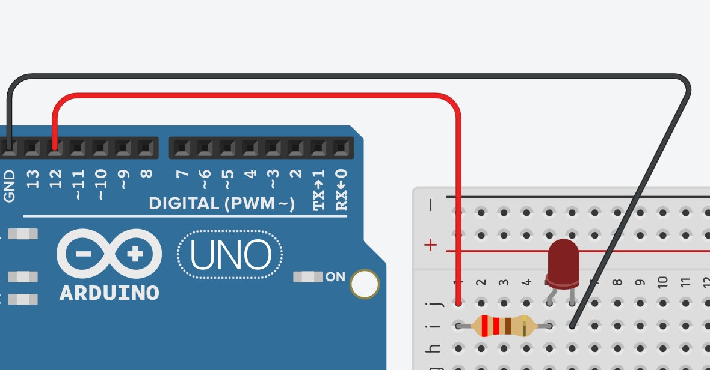

# **Parpadeo de un LED**



## **Explicación del código**

Este programa es el clásico “Blink” de Arduino. Su objetivo es encender y apagar un LED conectado al pin digital 12 en intervalos regulares de 300 milisegundos. Es el equivalente al “¡Hola, mundo!” en la programación de hardware y sirve para verificar que la placa, el compilador y la conexión del LED funcionan correctamente[reference:0]. A continuación se desglosa el funcionamiento de cada parte del programa.

### **1. Estructura `setup()`**

```c++
void setup()
{
  pinMode(12, OUTPUT);
}
```

- `pinMode(12, OUTPUT)`: Esta función configura el pin digital 12 como una salida. Un pin configurado como `OUTPUT` puede entregar voltaje (5 V o 3.3 V cuando se pone en `HIGH`) o conectarse a tierra (0 V cuando se pone en `LOW`)[reference:1].
- El `setup()` se ejecuta **una sola vez** al inicio del programa, justo después de que la placa recibe alimentación o es reiniciada[reference:2]. Aquí se colocan todas las instrucciones de configuración inicial, como definir el modo de los pines.

### **2. Bucle principal `loop()`**

```c++
void loop()
{
  digitalWrite(12, HIGH);
  delay(300); // Wait for 300 millisecond(s)
  digitalWrite(12, LOW);
  delay(300); // Wait for 300 millisecond(s)
}
```

- `digitalWrite(12, HIGH)`: Pone el pin 12 en **5 V**. Esto enciende el LED (si está correctamente conectado)[reference:3].
- `delay(300)`: Detiene la ejecución del programa durante 300 milisegundos. Durante este tiempo el pin 12 permanece en `HIGH`, por lo que el LED se mantiene encendido.
- `digitalWrite(12, LOW)`: Pone el pin 12 en **0 V**. Esto apaga el LED.
- `delay(300)`: El programa se detiene nuevamente 300 ms con el LED apagado.
- Al terminar las instrucciones, `loop()` **se ejecuta de nuevo desde el principio** y el proceso se repite indefinidamente[reference:4].

### **3. Consideraciones importantes**

#### **¿Por qué se debe usar una resistencia en serie con el LED?**
Las resistencias de 220 Ω (como las mencionadas en el comentario del código original) limitan la corriente que circula por el LED. Sin ella, el LED podría quemarse inmediatamente, ya que la corriente sería excesiva[reference:5]. Con una resistencia de 220 Ω, la corriente se limita a aproximadamente 22.7 mA (5 V / 220 Ω), un valor seguro para la mayoría de los LEDs[reference:6]. 

#### **¿Qué pasa si se usan otros valores de delay?**
- Si se disminuye el tiempo de espera, el LED parpadeará más rápido; si se aumenta, lo hará más lento[reference:7].
- Si se igualan los dos delays (por ejemplo, 300 ms y 300 ms), la duración del encendido y del apagado es la misma.
- Si se cambian los valores de manera asimétrica, el LED permanecerá encendido o apagado por más tiempo, generando un efecto visual similar a un latido[reference:8].

### **Código completo para copiar y pegar**

```c++
// Parpadeo de un LED
// Las resistencias son de 220 Ω

void setup()
{
  pinMode(12, OUTPUT);
}

void loop()
{
  digitalWrite(12, HIGH);
  delay(300); // Espera 300 milisegundos
  digitalWrite(12, LOW);
  delay(300); // Espera 300 milisegundos
}
```

### **Enlace al simulador**

[Código en Tinkercad](https://www.tinkercad.com/things/hcn4lwRh4KY-practica-01-parpadeo-de-un-led)

---

## **Preguntas teóricas**

1. ¿Qué diferencia hay entre `digitalWrite(pin, HIGH)` y `digitalWrite(pin, LOW)`? ¿Qué voltaje se mide en el pin en cada caso?
2. ¿Por qué es necesario configurar el pin con `pinMode(pin, OUTPUT)` antes de usar `digitalWrite()`?
3. ¿Qué ocurre si se conecta el LED directamente al pin 13 (que ya tiene un LED interno en la placa Arduino Uno)? ¿Se necesita una resistencia externa? ¿Por qué?[reference:9]
4. Si se cambian ambos `delay(300)` por `delay(1000)`, ¿cuánto tiempo permanece encendido el LED y cuánto tiempo permanece apagado en cada ciclo? ¿Cuál es la frecuencia de parpadeo?
5. ¿Qué limitación tiene la función `delay()`? ¿Cómo afecta esa limitación a un programa que necesita leer constantemente un sensor mientras el LED parpadea?

---

## **Ejercicios prácticos (modificar el código y anotar cambios)**

**Instrucciones:** Para cada ejercicio, copia el código original, realiza la modificación indicada, carga el programa en el simulador (o en el Arduino real) y describe cómo cambia el comportamiento del circuito.

### **Ejercicio 1**
Cambia el valor de los dos `delay(300)` por `delay(100)`.
*Pregunta:* ¿Qué observas en el LED? ¿Sigue siendo claramente visible el parpadeo o se percibe el LED como permanentemente encendido pero con menor brillo? ¿Por qué ocurre este efecto visual?[reference:10]

### **Ejercicio 2**
Modifica el programa para que el LED permanezca encendido 50 ms y apagado 950 ms.
*Pregunta:* ¿Cómo se percibe ahora el LED? ¿Qué relación hay entre los tiempos de encendido y apagado y la percepción visual de brillo?

### **Ejercicio 3**
Conecta un LED externo al pin 9 (no olvides la resistencia de 220 Ω) y modifica el programa para que parpadee en ese pin en lugar del pin 12.
*Pregunta:* ¿El comportamiento es idéntico al original? ¿Qué ventaja tiene usar un pin digital cualquiera en lugar de depender del LED interno de la placa?[reference:11]

### **Ejercicio 4**
Añade un segundo LED (con su resistencia) conectado al pin 8. Modifica el programa para que ambos LEDs parpadeen **alternadamente**: cuando el LED del pin 12 esté encendido, el del pin 8 debe estar apagado, y viceversa.
*Pregunta:* Describe con tus palabras la secuencia de luces que se observa. ¿Cuánto tiempo permanece cada LED encendido en cada ciclo?

### **Ejercicio 5**
Reemplaza las instrucciones `digitalWrite(12, HIGH)` y `LOW` por las siguientes líneas:
```c++
digitalWrite(12, HIGH);
digitalWrite(12, LOW);
delay(300);
digitalWrite(12, HIGH);
delay(300);
digitalWrite(12, LOW);
delay(300);
```
*Pregunta:* ¿Qué patrón de parpadeo se obtiene? ¿El LED se enciende y apaga con la misma duración? ¿Cuántos ciclos de encendido/apagado se producen en cada iteración del `loop()`?

---

*Entregar las respuestas a las preguntas teóricas y la descripción de los cambios observados en cada ejercicio.*