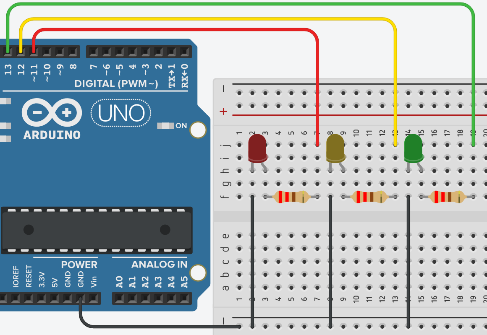

# **Encendido y apagado de leds - Declaración de Variables**



## **Explicación del código**

Este programa enciende tres LEDs (verde, amarillo, rojo) de forma secuencial ascendente (primero verde, luego amarillo, luego rojo) y luego los apaga en orden descendente (rojo, amarillo, verde). Cada acción dura 1 segundo (1000 ms), lo que produce un efecto de “llenado” y “vaciado” de luces. Es una introducción al uso de variables para almacenar tiempos de espera.

### **1. Declaración de variables globales**

```c++
//Bloque de Declaración 
const int led_red = 11;
int led_yellow = 12;
int led_green = 13;
int espera1s = 1000;
int espera2s = 2000;
```

- `const int led_red = 11;` → constante para el pin del LED rojo (pin 11). No cambiará.
- `int led_yellow = 12;` → variable (no constante) para el LED amarillo (pin 12).
- `int led_green = 13;` → variable para el LED verde (pin 13).
- `int espera1s = 1000;` → variable que almacena 1000 milisegundos (1 segundo). Se usará para los retardos.
- `int espera2s = 2000;` → declarada pero **no utilizada** en el código. Se podría usar para retardos más largos en el futuro.
- **Ventaja de usar variables para tiempos:** permite cambiar la duración de todos los retardos simplemente modificando `espera1s` una sola vez, en lugar de cambiar cada `delay()` individualmente.

### **2. Configuración `setup()`**

```c++
void setup()
{
  pinMode(led_red, OUTPUT);
  pinMode(led_yellow, OUTPUT);
  pinMode(led_green, OUTPUT);  
}
```

- Configura los tres pines como salidas digitales (`OUTPUT`), necesario para encender/apagar los LEDs con `digitalWrite()`.

### **3. Bucle `loop()`**

```c++
void loop()
{
  
  //Encendido Ordenado
  
  // bloque de encendido 
  digitalWrite(led_green, HIGH);
  delay(espera1s);
  digitalWrite(led_yellow, HIGH);
  delay(espera1s);
  digitalWrite(led_red, HIGH);
  delay(espera1s);
  
  // bloque de apagado 
  digitalWrite(led_red, LOW);
  delay(espera1s);
  digitalWrite(led_yellow, LOW);
  delay(espera1s);
  digitalWrite(led_green, LOW);
  delay(espera1s);
  
}
```

#### **Bloque de encendido**
- `digitalWrite(led_green, HIGH)` → enciende LED verde.
- `delay(espera1s)` → espera 1000 ms (1 segundo) manteniéndolo encendido.
- `digitalWrite(led_yellow, HIGH)` → añade LED amarillo; ahora verde y amarillo encendidos.
- `delay(espera1s)` → espera 1 segundo con los dos encendidos.
- `digitalWrite(led_red, HIGH)` → añade LED rojo; los tres LEDs completamente encendidos.
- `delay(espera1s)` → espera 1 segundo con los tres encendidos.

#### **Bloque de apagado**
- `digitalWrite(led_red, LOW)` → apaga el rojo (quedan verde y amarillo).
- `delay(espera1s)` → espera 1 segundo.
- `digitalWrite(led_yellow, LOW)` → apaga el amarillo (solo queda verde).
- `delay(espera1s)` → espera 1 segundo.
- `digitalWrite(led_green, LOW)` → apaga el verde (todos apagados).
- `delay(espera1s)` → espera 1 segundo antes de repetir la secuencia.

**Secuencia completa de luces:**
- T = 0 s: solo verde
- T = 1 s: verde + amarillo
- T = 2 s: verde + amarillo + rojo
- T = 3 s: verde + amarillo (rojo apagado)
- T = 4 s: solo verde
- T = 5 s: todos apagados
- Vuelve a empezar.

### **Código completo para copiar y pegar**

```c++
// Encendido y apagado de leds - Declaración de Variables
// Resistencias de 220 ohm en serie con cada LED

const int led_red = 11;
int led_yellow = 12;
int led_green = 13;
int espera1s = 1000;
int espera2s = 2000;  // No usado en este código, pero disponible

void setup()
{
  pinMode(led_red, OUTPUT);
  pinMode(led_yellow, OUTPUT);
  pinMode(led_green, OUTPUT);  
}

void loop()
{
  // Bloque de encendido (acumulativo)
  digitalWrite(led_green, HIGH);
  delay(espera1s);
  digitalWrite(led_yellow, HIGH);
  delay(espera1s);
  digitalWrite(led_red, HIGH);
  delay(espera1s);
  
  // Bloque de apagado (decremental)
  digitalWrite(led_red, LOW);
  delay(espera1s);
  digitalWrite(led_yellow, LOW);
  delay(espera1s);
  digitalWrite(led_green, LOW);
  delay(espera1s);
}
```

### **Enlace al simulador**

[Código en Tinkercad](https://www.tinkercad.com/things/krWwHGmK3JH-practica-02-p2-encendido-y-apagado-de-leds-declaracion-de)

---

## **Preguntas teóricas**

1. ¿Por qué en el bloque de encendido se encienden los LEDs en orden `verde → amarillo → rojo`, y en el apagado se apagan en orden `rojo → amarillo → verde`? ¿Qué pasaría si en el apagado se apagaran en el mismo orden que el encendido (verde, amarillo, rojo)?
2. ¿Qué ventaja tiene almacenar el tiempo de espera en una variable (`espera1s`) en lugar de escribir directamente `delay(1000)` en cada línea?
3. En este programa la variable `espera2s` está declarada pero nunca se usa. ¿Es un error? ¿Puede eliminarse sin afectar el funcionamiento?
4. Si se cambia `espera1s` a 500, ¿cuánto tiempo tarda una iteración completa del `loop()`? Calcula el nuevo ciclo completo.
5. Describe con tus palabras el estado de los LEDs en los instantes: 0.5 s, 2.5 s, 4.2 s, 5.8 s (suponiendo que el `loop()` comienza en t=0).

---

## **Ejercicios prácticos (modificar el código y anotar cambios)**

**Instrucciones:** Para cada ejercicio, copia el código original, realiza la modificación indicada, carga el programa en el simulador (o en Arduino real) y describe cómo cambia el comportamiento del circuito.

### **Ejercicio 1**
Cambia el orden de encendido para que sea: rojo primero, luego amarillo, luego verde. Mantén el mismo orden de apagado (rojo, amarillo, verde).  
*Pregunta:* ¿Cómo se modifica la secuencia visual? ¿Sigue siendo simétrica la subida y bajada?

### **Ejercicio 2**
Utiliza la variable `espera2s` que está declarada (2000 ms). Modifica el programa para que el tiempo entre encender un LED y el siguiente sea de 1 segundo (`espera1s`), pero el tiempo entre el apagado de un LED y el siguiente sea de 2 segundos (`espera2s`).  
*Pregunta:* ¿Qué efecto produce esta asimetría? ¿Cómo se percibe visualmente?

### **Ejercicio 3**
Añade un cuarto LED azul en el pin 10. Modifica el programa para que la secuencia de encendido sea: verde → amarillo → rojo → azul, y el apagado sea en orden inverso: azul → rojo → amarillo → verde. Usa `espera1s` para todos los retardos.  
*Pregunta:* ¿Cuánto dura ahora un ciclo completo? Describe la secuencia de luces paso a paso.

### **Ejercicio 4**
Elimina el último `delay(espera1s)` que está después de apagar el verde (al final del `loop()`).  
*Pregunta:* ¿Qué cambia en la secuencia? ¿Se nota alguna diferencia al final del ciclo? ¿Por qué el programa sigue funcionando?

### **Ejercicio 5**
Reemplaza el bloque de encendido y apagado por una estructura que use un **bucle `for`** para recorrer un arreglo de pines. El comportamiento debe ser idéntico: encender acumulativamente (verde, luego amarillo, luego rojo) con un segundo entre cada paso, luego apagar decrementalmente.  
**Pista:** Puedes usar dos bucles: uno para encender progresivamente y otro para apagar.  
*Pregunta:* ¿El programa es más corto o más largo? ¿Qué ventaja tiene esta versión si quisieras agregar 10 LEDs?

---

*Entregar las respuestas a las preguntas teóricas y la descripción de los cambios observados en cada ejercicio.*