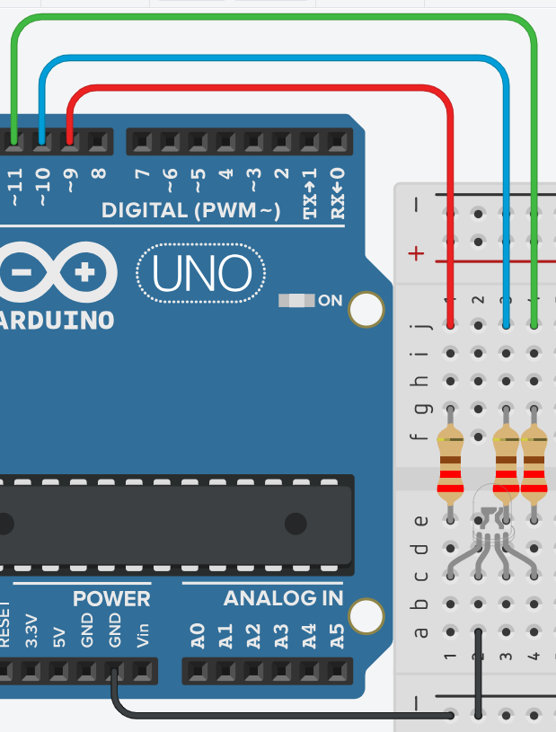

# **LED RGB - Declaración de Variables**



## **Explicación del código**

Este programa controla un LED RGB (Rojo, Verde, Azul) para generar una secuencia de siete colores distintos: azul, verde, cian, rojo, magenta, amarillo y blanco. Cada color se mantiene durante un segundo (1000 ms). Es una excelente introducción al concepto de mezcla de colores aditiva y al uso de múltiples salidas digitales para crear efectos visuales.

Un LED RGB combina tres LEDs individuales (rojo, verde y azul) en un solo encapsulado, lo que permite generar una amplia gama de colores al encenderlos con diferentes intensidades[reference:0].

### **1. Declaración de variables globales**

```c++
int ledR = 9, ledG = 11, ledB = 10;
int espera = 1000;
```

- `int ledR = 9`, `int ledG = 11`, `int ledB = 10`: Declara variables para asignar los pines de cada color. El programa usa los pines 9 para el rojo, 11 para el verde y 10 para el azul.
- `int espera = 1000`: Define el tiempo de retardo de 1000 milisegundos (1 segundo), que controla cuánto tiempo permanece visible cada color.
- **PWM implicado**: Para lograr distintos niveles de brillo (y así generar colores secundarios), se necesitarían pines con capacidad PWM. Aunque este código usa `digitalWrite()` (solo valores HIGH o LOW), los pines 9, 10 y 11 son PWM, lo que permitiría modificar el programa para ajustar la intensidad.
- **Conexión del LED**: Los LEDs RGB pueden ser de **cátodo común** (conectan a GND) o de **ánodo común** (conectan a VCC). La programación es inversa en cada caso[reference:1]. Para un LED de cátodo común, se envía HIGH para encender un color; para uno de ánodo común, se envía LOW.

### **2. Configuración `setup()`**

```c++
void setup()
{
  pinMode(ledR, OUTPUT);
  pinMode(ledG, OUTPUT);
  pinMode(ledB, OUTPUT);
}
```

- Configura los tres pines de color como salidas digitales (`OUTPUT`), permitiendo controlar el encendido y apagado de cada LED.

### **3. Bucle principal `loop()`**

```c++
void loop()
{
  digitalWrite(ledR, LOW);
  digitalWrite(ledG, LOW);
  //Color AZUL
  digitalWrite(ledB, HIGH);
  delay(espera);
  //Color Verde
  digitalWrite(ledB, LOW);
  digitalWrite(ledG, HIGH);
  delay(espera);
  //Color Cian
  digitalWrite(ledB, HIGH);
  delay(espera);
  //Color ROJO
  digitalWrite(ledB, LOW);
  digitalWrite(ledG, LOW);
  digitalWrite(ledR, HIGH);
  delay(espera);
  //Magenta
  digitalWrite(ledB, HIGH);
  delay(espera);
  //Amarillo
  digitalWrite(ledB, LOW);
  digitalWrite(ledG, HIGH);
  delay(espera);
  //Blanco
  digitalWrite(ledB, HIGH);
  delay(espera);
}
```

El programa enciende y apaga combinaciones de los LEDs rojo, verde y azul para formar distintos colores. Se asume un LED de **cátodo común**, donde un estado `HIGH` enciende el color.

- **Inicio**: Apaga rojo y verde (el azul ya estaba apagado desde el ciclo anterior).
- **AZUL**: Enciende solo el LED azul.
- **Verde**: Apaga el azul y enciende el verde.
- **Cian**: Enciende el azul (el verde ya estaba encendido). Resultado: **verde + azul = cian**.
- **ROJO**: Apaga azul y verde, y enciende el rojo.
- **Magenta**: Enciende el azul (el rojo ya estaba encendido). Resultado: **rojo + azul = magenta**.
- **Amarillo**: Apaga el azul y enciende el verde (el rojo sigue encendido). Resultado: **rojo + verde = amarillo**.
- **Blanco**: Enciende el azul (el rojo y verde ya están encendidos). Resultado: **rojo + verde + azul = blanco**.
- El ciclo se repite continuamente.

**Nota adicional**: Este código asume que el LED RGB funciona lógicamente con `HIGH` para encender. Para un LED de ánodo común, se debería invertir la lógica.

### **Código completo para copiar y pegar**

```c++
// LED RGB - Declaración de Variables
// Usar resistencias de 220 ohm para cada color del LED RGB

int ledR = 9, ledG = 11, ledB = 10;
int espera = 1000;

void setup()
{
  pinMode(ledR, OUTPUT);
  pinMode(ledG, OUTPUT);
  pinMode(ledB, OUTPUT);
}

void loop()
{
  // Apagar rojo y verde antes de empezar la secuencia
  digitalWrite(ledR, LOW);
  digitalWrite(ledG, LOW);
  
  //Color AZUL
  digitalWrite(ledB, HIGH);
  delay(espera);
  
  //Color Verde
  digitalWrite(ledB, LOW);
  digitalWrite(ledG, HIGH);
  delay(espera);
  
  //Color Cian (verde + azul)
  digitalWrite(ledB, HIGH);
  delay(espera);
  
  //Color ROJO
  digitalWrite(ledB, LOW);
  digitalWrite(ledG, LOW);
  digitalWrite(ledR, HIGH);
  delay(espera);
  
  //Magenta (rojo + azul)
  digitalWrite(ledB, HIGH);
  delay(espera);
  
  //Amarillo (rojo + verde)
  digitalWrite(ledB, LOW);
  digitalWrite(ledG, HIGH);
  delay(espera);
  
  //Blanco (rojo + verde + azul)
  digitalWrite(ledB, HIGH);
  delay(espera);
}
```

### **Enlace al simulador**

[Código en Tinkercad](https://www.tinkercad.com/things/5WRUN4WovN9-practica-02-p4-led-rgb-declaracion-de-variables)

---

## **Preguntas teóricas**

1. ¿Qué diferencia hay entre un LED RGB de cátodo común y uno de ánodo común? ¿Cómo afecta esto al código?
2. En el código, ¿por qué se apagan los LEDs rojo y verde al inicio del `loop()` si ya estaban apagados del ciclo anterior?
3. Si se cambiara el tiempo `espera` a 500 ms, ¿cuánto duraría un ciclo completo? Calcula el valor.
4. Explica cómo se genera el color cian en el código y qué combinación de luces representa.
5. ¿Por qué es necesario usar resistencias de 220 Ω para cada pin de color del LED RGB? ¿Qué ocurriría si no se usaran?

---

## **Ejercicios prácticos (modificar el código y anotar cambios)**

**Instrucciones:** Para cada ejercicio, copia el código original, realiza la modificación indicada, carga el programa en el simulador (o en el Arduino real) y describe cómo cambia el comportamiento del circuito.

### **Ejercicio 1**
Modifica el programa para que muestre los colores en el siguiente orden: **rojo → verde → azul → amarillo → magenta → cian → blanco**.  
*Pregunta:* ¿Cambia la forma en que se encienden y apagan los LEDs? ¿Cómo se logra el amarillo en este nuevo orden?

### **Ejercicio 2**
Añade un **LED blanco adicional** (cualquier pin digital) que se encienda únicamente cuando el LED RGB muestre el color blanco.  
*Pregunta:* ¿El LED adicional se sincroniza correctamente con el blanco del RGB? ¿Qué instrucciones añadiste?

### **Ejercicio 3**
Reemplaza todos los `digitalWrite()` por `analogWrite()` para controlar la intensidad. Configura los valores para que los colores secundarios se vean con una mezcla más suave. Por ejemplo: cian con azul al 50% y verde al 100%.  
*Pregunta:* ¿Qué diferencia visual notas? ¿Por qué se puede lograr un degradado usando `analogWrite()`?

### **Ejercicio 4**
Reduce el tiempo de espera a 200 ms. Observa el efecto visual.  
*Pregunta:* ¿A partir de qué velocidad el ojo humano deja de distinguir los colores individualmente y percibe una mezcla continua? ¿Por qué ocurre esto?

### **Ejercicio 5**
Invierte la lógica del programa para que funcione con un **LED RGB de ánodo común**. Mantén la misma secuencia de colores.  
*Pregunta:* ¿Qué cambios tuviste que hacer en los `digitalWrite()`? ¿El resultado visual es el mismo que con cátodo común?

---

*Entregar las respuestas a las preguntas teóricas y la descripción de los cambios observados en cada ejercicio.*