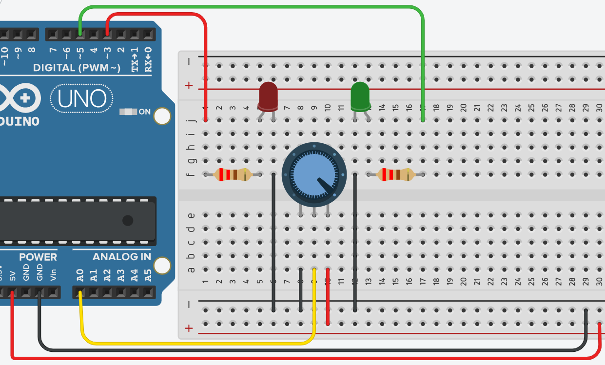

# **Control de Distribución de voltaje - Declaración de Variables**



## **Explicación del código**

Este programa lee el valor de un potenciómetro conectado a la entrada analógica A0 y controla dos LEDs (verde y rojo) de forma que la intensidad luminosa se distribuye de manera complementaria: cuando uno se ilumina más, el otro se ilumina menos. El objetivo es visualizar cómo se puede repartir una señal de voltaje entre dos salidas PWM.

### **1. Declaración de variables globales**

```c++
int ptm = A0, ldG = 5, ldR = 3, lectura = 0;
// Las resistencias son 220 ohm
```

- `ptm = A0`: Define la variable `ptm` (potenciómetro) que almacena el número del pin analógico A0 donde se leerá el voltaje del potenciómetro.
- `ldG = 5`: Pin digital 5 (con capacidad PWM) para el LED verde.
- `ldR = 3`: Pin digital 3 (con capacidad PWM) para el LED rojo.
- `lectura = 0`: Variable donde se guardará el valor leído del potenciómetro (entre 0 y 1023).
- El comentario indica que las resistencias en serie con los LEDs son de 220 Ω, lo cual es adecuado para limitar la corriente a unos 20 mA cuando el LED está al máximo (5V / 220Ω ≈ 22.7 mA).

### **2. Configuración en `setup()`**

```c++
void setup()
{
  pinMode(ldG, OUTPUT);
  pinMode(ldR, OUTPUT);
}
```

- Se configuran los pines de los LEDs como salidas (`OUTPUT`). No es necesario configurar el pin analógico `A0` porque `analogRead()` lo hace implícitamente.

### **3. Bucle principal `loop()`**

```c++
void loop()
{
  lectura = analogRead(ptm);
  analogWrite(ldG, lectura/4);
  analogWrite(ldR, (1023 - lectura)/4);
}
```

#### **Lectura del potenciómetro**
- `analogRead(ptm)`: Lee el voltaje en el pin A0 (0V a 5V) y lo convierte a un valor entero entre 0 y 1023. Ese valor es proporcional a la posición del potenciómetro.

#### **Escritura analógica en los LEDs**
- `analogWrite(pin, valor)` recibe un valor entre 0 y 255 (PWM de 8 bits). Como `lectura` está en el rango 0-1023, dividimos entre 4 para escalarlo a 0-255.
  - `lectura/4` → intensidad del LED verde. Cuando el potenciómetro está al máximo (1023), el verde recibe 255 (máximo brillo). En el mínimo (0), recibe 0 (apagado).
  - `(1023 - lectura)/4` → intensidad del LED rojo. Es complementaria: si el potenciómetro da 0, el rojo recibe 1023/4 ≈ 255 (máximo brillo); si da 1023, recibe 0 (apagado).

De esta forma se logra una **distribución inversa** del voltaje: a mayor voltaje en la entrada, más brillante el LED verde y más tenue el rojo; y viceversa.

### **Código completo para copiar y pegar**

```c++
// Control de Distribución de voltaje - Declaración de Variables
// Las resistencias son 220 ohm

int ptm = A0, ldG = 5, ldR = 3, lectura = 0;

void setup()
{
  pinMode(ldG, OUTPUT);
  pinMode(ldR, OUTPUT);
}

void loop()
{
  lectura = analogRead(ptm);
  analogWrite(ldG, lectura/4);
  analogWrite(ldR, (1023 - lectura)/4);
}
```

### **Enlace al simulador**

[Código en Tinkercad](https://www.tinkercad.com/things/33qYNMkk8s4-practica-03-p1-control-de-distribucion-de-voltaje-declaracion-de)

---

## **Preguntas teóricas**

1. ¿Qué rango de valores devuelve `analogRead()` y qué rango de valores espera `analogWrite()`? ¿Por qué se divide entre 4 en el código?
2. Explica qué pasaría si conectamos el LED rojo al pin 4 (que no tiene capacidad PWM) en lugar del pin 3.
3. ¿Qué función cumplen las resistencias de 220 Ω en serie con los LEDs? ¿Qué ocurriría si no se usaran?
4. Describe con tus palabras el comportamiento del circuito cuando el potenciómetro está en la posición media (aproximadamente 2.5V).
5. ¿Por qué se utiliza `(1023 - lectura)/4` para el LED rojo y no `lectura/4` directamente? ¿Qué relación existe entre ambos LEDs?

---

## **Ejercicios prácticos (modificar el código y anotar cambios)**

**Instrucciones:** Para cada ejercicio, copia el código original, realiza la modificación indicada, carga el programa en el simulador (o en el Arduino real) y describe cómo cambia el comportamiento del circuito.

### **Ejercicio 1**
Modifica la línea que controla el LED verde para que su brillo sea `lectura/2` en lugar de `lectura/4`.  
*Pregunta:* ¿Qué observas? ¿Por qué ahora el verde no se apaga completamente cuando el potenciómetro está al mínimo?

### **Ejercicio 2**
Cambia el pin del LED rojo al pin 6 (que también tiene PWM) y ajusta la declaración de variables en consecuencia.  
*Pregunta:* ¿El funcionamiento sigue siendo el mismo? ¿Qué cambió?

### **Ejercicio 3**
Intercambia las fórmulas: asigna al LED verde `(1023 - lectura)/4` y al LED rojo `lectura/4`.  
*Pregunta:* ¿Cómo se comportan ahora los LEDs al girar el potenciómetro? Explica la diferencia.

### **Ejercicio 4**
En lugar de usar dos LEDs, comenta el `analogWrite` del LED rojo y añade una línea que encienda un LED azul (pin 9) con la expresión `lectura/4`.  
*Pregunta:* ¿Qué patrón de iluminación observas? ¿Sigue siendo complementario?

### **Ejercicio 5**
Añade un tercer LED amarillo en el pin 10 y haz que su brillo sea `(lectura/4 + (1023-lectura)/4)/2` (el promedio de los otros dos).  
*Pregunta:* ¿Cuándo brilla más el amarillo? ¿Qué relación tiene con los otros dos LEDs?

--- 

*Entregar las respuestas a las preguntas teóricas y la descripción de los cambios observados en cada ejercicio. Anotados en su cuaderno*