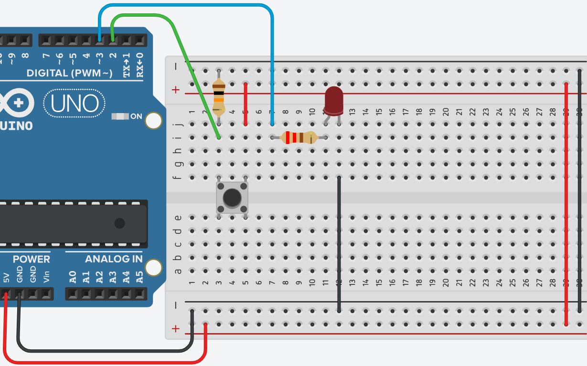

# **Parpadeo de un LED**



## **Explicación del código**

Este programa implementa un interruptor tipo “toggle” usando un pulsador y un LED, pero a diferencia de la versión anterior (que usaba `if`), aquí se emplean bucles `while` para esperar activamente a que el pulsador cambie de estado. Cada vez que se presiona el botón, el LED cambia de estado (se enciende si estaba apagado, o se apaga si estaba encendido). Es una introducción al uso de bucles de espera y a la sincronización con entradas digitales.

### **1. Declaración de variables globales**

```c++
int btn_e = 2;
int led_s = 3;
int estado = LOW;
```

- `int btn_e = 2;`: Define el pin digital 2 como entrada para el pulsador.
- `int led_s = 3;`: Define el pin digital 3 como salida para el LED.
- `int estado = LOW;`: Almacena el estado actual del LED (LOW = apagado, HIGH = encendido). Aunque se declara como `int`, solo se usan los valores `LOW` y `HIGH`.

### **2. Configuración `setup()`**

```c++
void setup()
{
  pinMode(led_s, OUTPUT);
  pinMode(btn_e, INPUT);
  Serial.begin(9600);
}
```

- `pinMode(led_s, OUTPUT);`: Configura el pin del LED como salida.
- `pinMode(btn_e, INPUT);`: Configura el pin del pulsador como entrada. **Nota:** Se asume que el pulsador está conectado con una resistencia pull‑down externa (10kΩ a tierra). Si se usara la resistencia pull‑up interna, se debería cambiar a `INPUT_PULLUP` y ajustar la lógica.
- `Serial.begin(9600);`: Inicializa la comunicación serie a 9600 baudios. Aunque en el código actual no se usa `Serial.print()`, es común incluir esta línea para depuración (por ejemplo, para ver el estado del botón o del LED en el monitor serie).

### **3. Bucle `loop()` con bucles `while`**

```c++
void loop()
{
  while(digitalRead(btn_e) == LOW){
   
  }
 
  estado = digitalRead(led_s);
  digitalWrite(led_s, !estado);
  
  while(digitalRead(btn_e) == HIGH){
    
  }
}
```

#### **Primer bucle `while`: esperar a que se presione el botón**
- `while(digitalRead(btn_e) == LOW) { }`: Este bucle no hace nada (cuerpo vacío) mientras el pulsador **no** esté presionado (lectura `LOW`). El programa se queda atrapado aquí hasta que el usuario presione el botón.
- Cuando el botón se presiona, `digitalRead(btn_e)` devuelve `HIGH` y el bucle termina.

#### **Cambio de estado del LED**
- `estado = digitalRead(led_s);`: Lee el estado actual del LED (almacenado en el pin de salida). Esto es posible porque `digitalRead()` en un pin configurado como `OUTPUT` devuelve el último valor escrito.
- `digitalWrite(led_s, !estado);`: Escribe en el LED el valor **opuesto** al que tenía. El operador `!` invierte el valor: si estaba `HIGH` (encendido), escribe `LOW` (apagado); si estaba `LOW`, escribe `HIGH`. Así se logra el efecto toggle.

#### **Segundo bucle `while`: esperar a que se suelte el botón**
- `while(digitalRead(btn_e) == HIGH) { }`: Este bucle espera activamente a que el usuario **suelte** el botón (lectura `HIGH` → se mantiene en el bucle). Solo cuando el botón vuelve a `LOW` el programa continúa.
- Una vez que el botón se suelta, el bucle `loop()` se repite desde el principio, volviendo al primer `while` a esperar una nueva presión.

#### **Ventajas y desventajas de este enfoque**
- **Ventaja:** La lógica de toggle es muy clara y no requiere variables auxiliares como en la versión con `if`. El programa cambia el estado exactamente una vez por cada pulsación completa (presionar + soltar).
- **Desventaja:** Los bucles `while` vacíos son **bloqueantes**. Mientras espera, el programa no puede hacer nada más (por ejemplo, leer otros sensores, atender comunicaciones serie, etc.). Además, no hay ningún tipo de antirrebote: si el botón rebota al presionarse o soltarse, los bucles podrían terminar antes de tiempo y producir cambios indeseados.

### **Código completo para copiar y pegar**

```c++
// Parpadeo de un LED con pulsador usando while
// Conexiones:
// - LED ánodo → pin 3 (con resistencia 220Ω a GND)
// - Pulsador → pin 2 y GND (con resistencia pull‑down de 10kΩ)

int btn_e = 2;
int led_s = 3;
int estado = LOW;

void setup()
{
  pinMode(led_s, OUTPUT);
  pinMode(btn_e, INPUT);
  Serial.begin(9600);
}

void loop()
{
  // Esperar a que el botón sea presionado
  while(digitalRead(btn_e) == LOW){
    // No hacer nada mientras no se presiona
  }
 
  // Cambiar el estado del LED (toggle)
  estado = digitalRead(led_s);
  digitalWrite(led_s, !estado);
  
  // Esperar a que el botón sea soltado
  while(digitalRead(btn_e) == HIGH){
    // No hacer nada mientras se mantiene presionado
  }
}
```

### **Enlace al simulador**

[Código en Tinkercad](https://www.tinkercad.com/things/eGTJqYk5g9r-practica-03-p4-led-con-pulsador-while)

---

## **Preguntas teóricas**

1. ¿Qué diferencia fundamental hay entre usar `if (digitalRead(btn_e) == HIGH)` y usar `while(digitalRead(btn_e) == LOW)` para detectar la presión de un botón? ¿Cuál es el comportamiento de cada uno?
2. Explica por qué el programa necesita **dos** bucles `while`: uno para esperar a que se presione el botón y otro para esperar a que se suelte. ¿Qué ocurriría si solo se usara el primero?
3. En este código se lee el estado del LED con `digitalRead(led_s)` a pesar de que `led_s` está configurado como `OUTPUT`. ¿Es válido? ¿Qué valor devuelve `digitalRead()` en un pin de salida?
4. ¿Qué es el “rebote” (bouncing) de un pulsador? ¿Cómo afecta a este programa en particular? ¿Los bucles `while` lo solucionan o lo empeoran?
5. ¿Por qué se incluye `Serial.begin(9600)` en `setup()` si luego no se usa ninguna función `Serial.print()`? ¿Es opcional? ¿Qué ventaja podría tener mantenerlo para depuración?

---

## **Ejercicios prácticos (modificar el código y anotar cambios)**

**Instrucciones:** Para cada ejercicio, copia el código original, realiza la modificación indicada, carga el programa en el simulador (o en el Arduino real) y describe cómo cambia el comportamiento del circuito.

### **Ejercicio 1**
Añade una instrucción `delay(50);` justo después de cada `while` (tanto al salir del primer bucle como al salir del segundo). Observa la diferencia.
*Pregunta:* ¿El comportamiento mejora o empeora? ¿Se reduce el efecto del rebote? ¿Por qué?

### **Ejercicio 2**
Elimina el segundo bucle `while` (el que espera a que se suelte el botón). Deja solo el primer `while` y la lógica de toggle.
*Pregunta:* ¿Qué ocurre ahora cuando presionas el botón? ¿El LED cambia de estado una sola vez o varias? Explica por qué.

### **Ejercicio 3**
Modifica el programa para que, en lugar de hacer toggle con un solo LED, controle **dos LEDs**: uno en el pin 3 y otro en el pin 4. Cada vez que se presione el botón, deben intercambiar su estado (si el pin 3 está encendido y el pin 4 apagado, después de la presión deben quedar al revés).
*Pregunta:* ¿Cómo logras la inversión simultánea? ¿Necesitas variables adicionales?

### **Ejercicio 4**
Reemplaza los dos `while` por una sola estructura `if` que detecte el flanco de subida del botón (como en la práctica anterior). Mantén la lógica de toggle.
*Pregunta:* ¿Qué diferencias de comportamiento notas entre la versión con `while` y la versión con `if`? ¿Cuál es más robusta frente a rebotes?

### **Ejercicio 5**
Añade un **LED RGB** (conectado a los pines 9, 10 y 11). Modifica el programa para que cada vez que se presione el botón, el RGB cambie al siguiente color de una secuencia predefinida (por ejemplo: rojo → verde → azul → amarillo → magenta → cian → blanco → rojo...). Usa los bucles `while` para esperar la presión y el soltado.
*Pregunta:* ¿Cómo almacenas la secuencia de colores? ¿Qué ventaja tiene usar un índice que se incrementa con cada presión?

---

*Entregar las respuestas a las preguntas teóricas y la descripción de los cambios observados en cada ejercicio.*